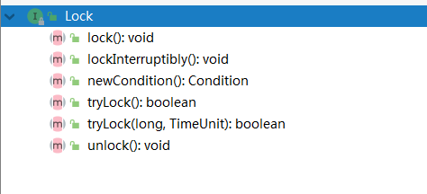

###  锁  
线程安全的三要素：原子性、可见性、顺序性  

#### `synchronized`锁  
* 互斥锁，一次只有一个线程进入 
* 可重入 
* Java中每个对象都有一个内置锁(监视器,也可以理解成锁标记)，而synchronized就是使用**对象的内置锁(监视器)**来将代码块(方法)锁定的
* jvm层面实现，通过关键字使用  

##### 用处  
1. 可见性， 当执行完`synchronized`之后，修改后的变量对其他的线程是可见的 
2. 原子性，只有一个线程能够访问  

##### 原理  
1. 同步代码块 
* monitorenter和monitorexit指令实现的 
2. 同步方法  
* 方法修饰符上的ACC_SYNCHRONIZED实现  

jvm层面是通过`monitor`对象，对象有自己的对象头，存储了很多信息，其中一个信息标示是被哪个线程持有  

##### 使用  
* 类锁  
* 对象锁  

##### 后续优化  
jdk1.6以后，对`synchronized`锁进行了优化  
* 关键字：适应自旋锁，锁消除，锁粗化，轻量级锁，偏向锁

#### 显示锁`lock`  
jdk1.5引入，Doug Lea大神的作品。 `lock`接口如下:  
  

特点： 
* Lock方式来获取锁支持中断、超时和重入  
* 提高了语义化，更高的灵活性，但是必须显示加锁，显示解锁  
* 支持Condition条件对象  
* 允许多个读线程同时访问共享资源  

##### `ReentrantLock`原理
`ReentrantLock`的实现基于`AQS`(`AbstractQueuedSynchronizer`)和`LockSupport`  

`AQS`的本质上是一个同步器/阻塞锁的基础框架，其作用主要是提供加锁、释放锁，并在内部维护一个`FIFO`等待队列，用于存储由于锁竞争而阻塞的线程。  

### jvm里面的其他锁 

* 自旋锁 

  

* 轻量级锁

  

* 重量级锁

### Ref 
1. [Java锁机制了解一下](https://juejin.im/post/5adf14dcf265da0b7b358d58)  
2. [ReentrantLock源码之一lock方法解析(锁的获取)](http://www.blogjava.net/zhanglongsr/articles/356782.html)  