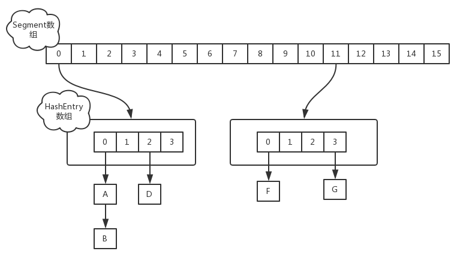

## JDK 7 
### 数据结构 
jdk7中采用segment和HashEntry的方式来实现，实际上就是**锁分段**的具体应用，默认使用了16把锁，具体的数据结构如下图：
 

其中`Segment`在实现上继承了`ReentrantLock`，使之自带了锁的功能

#### put实现 
先根据 `key`获得 `hashcode`找到segment数组中对应的位置，如果该segment还未初始化则先进行初始化，之后对该segment加锁，执行具体的put操作。

如果A，B两个线程同时进行put操作：
1. 线程A执行`trylock()`方法成功，拿到锁，将`value`插入该segment对应的位置 
2. 线程B没有拿到锁，执行`scanAndLockForPut()`方法，该方法会重新尝试`trylock()`方法获取锁，即自旋，尝试的次数为`MAX_SCAN_RETRIES`，该值在多核处理器下为64次，单核处理器为1次 
3. 线程B retry了`MAX_SCAN_RETRIES`之后还没有拿到锁，则挂起，等待A线程执行完操作后释放锁，并唤醒B线程 

PS：
1. `segment`中对`HashEntry`数组以及数组项中的节点链遍历操作是线程安全的，因而get、containsKey、put、putIfAbsent、replace、Remove、clear操作并发场景下实现比较高效
2. `size`、`containsValue`、`contains`、`isEmpty`操作，需要遍历整个`segment`数组，以`size()`方法实现为例，先尝试的遍历查找、计算2遍，如果两遍遍历过程中整个Map没有发生修改（即两次所有Segment实例中modCount值的和一致），则可以认为整个查找、计算过程中Map没有发生改变，我们计算的结果是正确的，否则，在顺序的在所有Segment实例加锁，计算，解锁，然后返回。因此这些操作对性能影响很大，尽量不要使用。

--- 
## JDK8 
jdk8中对 `ConcurrentHashMap`进行了优化，采用了`Node` + `CAS` + `Synchronized`来保证并发安全进行实现，结构如下：
 

