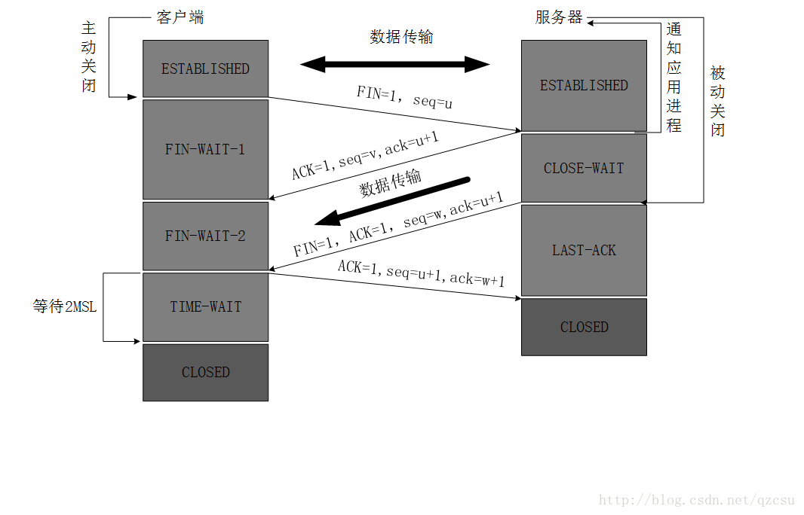

### TCP 

> 传输控制协议，是一种面向连接的、可靠的、基于字节流的传输层通信协议。TCP 负责在不可靠的传输信道之上提供可靠的抽象层，向应用层隐藏了大多数网络 通信的复杂细节，比如丢包重发、按序发送、拥塞控制及避免、数据完整，等等。 

* 三次握手

* 四次挥手 

* 拥塞预防及控制 

  * 慢启动 

    

  * 快速重传

    

  * 拥塞预防

  

* 拆包，粘包

* time_wait状态作用 

* 拥塞控制和流量控制区别 
  * 拥塞控制：针对的是传输路径上面的traffic做控制
  * 流量控制：针对接收方当前能够接受的buffer的能力做控制

### UDP 

* 是什么

  

* 常见用途

* 设计可靠性高的udp思路 

quic？

#### 参考 

1.[TCP的三次握手与四次挥手(详解+动图)](https://blog.csdn.net/qzcsu/article/details/72861891)

2.[TCP粘包问题及其解决方案？](https://www.v2ex.com/t/478610?p=2) *主要参考评论*

3.[web性能权威指南]()

4.[构建高性能web站点]()

5.[既然有了滑动窗口，为什么还要有等同于滑动窗口的拥塞窗口？](https://www.zhihu.com/question/264518499)

6.[TCP那些事儿？上](https://coolshell.cn/articles/11564.html)

