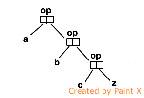

### 右折叠  
右折叠算法，非尾递归
```scala
 def foldRight[A,B](l: List[A], z: B)(op: (A,B) => B): B = l match {
           case Nil => z
           case Cons(h,t) => op(h,foldRight(t,z)(f))
       }
```



### 左折叠 
左折叠算法，递归，注意栈深度
```scala
 def foldLeft[A,B](l: List[A], acc: B)(op: (B,A) => B): B = l match {
          case Nil => acc
          case Cons(h,t) => foldLeft(t,op(acc,h))(op)
      }
```

 

---

#### 参考 
1. [泛函编程（7）－数据结构－List－折叠算法](http://www.cnblogs.com/tiger-xc/p/4330727.html)
2. [foldleft-and-foldright](http://hongjiang.info/foldleft-and-foldright/)