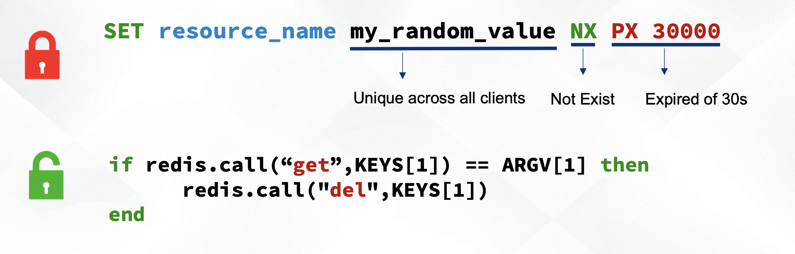

## 分布式锁的几种实现

### MySQL

#### 悲观锁

```mysql
# 共享锁，可以并发读，不能并发写
slect ... lock in share mode 

# 悲观锁
select ... for update
```

* 优点

  * 实现简单，不容易出错

* 缺点
     * 悲观锁有死锁的风险，需要警惕加锁的顺序
     * 悲观锁对数据库资源有消耗
     * 悲观锁的where条件一定要能命中索引，不然会出现大氛围的锁甚至是表锁
     * 依赖具体数据库的实现，不同的db的悲观锁的实现方式可能不一样

  **一般业务场景推荐使用悲观锁**

### 乐观锁

1. ```mysql
   select id, data, version from table where id=$ID;
   ```

2. {bussiness code}

3. ```mysql
   update table set data=$DATA and version=$VERSION+1 where id=$ID and version=$VERSION;
   ```

4. If update failed, goto step 1

思路和CAS的思路类似

* 优点
  * 不依赖与具体数据库的实现
  * 性能比MySQL的悲观锁高
* 缺点
  * 实现复杂一些
  * 在宝高并发的场景下性能下降厉害，会出现大量线程自旋
  * 对业务又侵入性，所有的地方都需要有这么一套逻辑

## Lock Manager

#### 要求

* 需要lease机制，保证服务挂了的时候，自己能够释放锁
* 保证HA，不允许单点故障，因此需要有持久化存储
* 死锁检测（锁过期，心跳等），**这里坑比较多**

#### 常见的实现

* [Red Lock](https://redis.io/topics/distlock)

整个加锁和解锁的模型



实现是在client端

具体的Red Lock算法可以查看官网详情

**算法的问题**

* 过于依赖时间，分布式系统下时钟无法做到全局唯一，有时钟跳跃的风险
* GC问题导致同时获取锁
* 网络超长延迟（超过了锁周期）服务才收到加锁回复，导致并发加锁了

> The algorithm makes dangerous assumptions about timing and system clocks

更加具体的可以参考[how to do distributed locking](https://martin.kleppmann.com/2016/02/08/how-to-do-distributed-locking.html)


* [ZK](https://zookeeper.apache.org/doc/r3.1.2/recipes.html)/ETCD

依赖zk的临时顺序节点，新加锁通过watch前一个节点新增一个临时节点，这里相当于有一个排队机制在里面，可以有效的避免惊群效应


* Google  Chubby

省略

### 参考

1. [Distributed Lock Manager](https://www.youtube.com/watch?v=vFW1U1vimVs)
2. [patterns-of-distributed-systems](https://martinfowler.com/articles/patterns-of-distributed-systems/)
